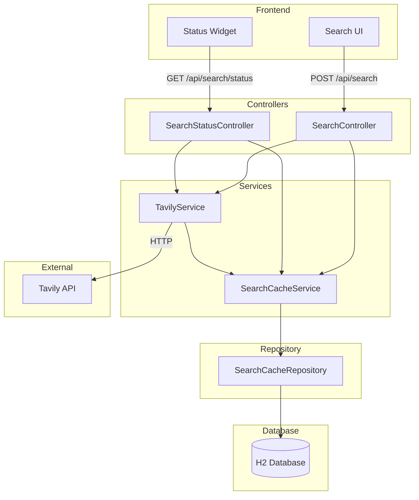

# Design Document: Search & Tavily API Integration

## Overview

This design document describes the architecture and implementation approach for the Search & Tavily API Integration feature. The feature provides the core search functionality for the GoogleV1 application by integrating with the Tavily API, implementing a caching layer for performance optimization, and exposing health monitoring endpoints.

The system follows a layered architecture with clear separation between controllers, services, repositories, and DTOs. Spring Boot's WebClient is used for reactive HTTP communication with the Tavily API, and JPA is used for cache persistence.

## Architecture



## Components and Interfaces

### Controllers

#### SearchController
- **Path**: `/api/search`
- **Method**: `POST`
- **Responsibility**: Accepts search requests, delegates to TavilyService, returns normalized results
- **Dependencies**: TavilyService, SearchCacheService

```java
@RestController
@RequestMapping("/api/search")
public class SearchController {
    SearchResponse search(@RequestBody SearchRequest request);
}
```

#### SearchStatusController
- **Path**: `/api/search/status`
- **Method**: `GET`
- **Responsibility**: Returns health status, cache statistics, and API metrics
- **Dependencies**: SearchCacheService, TavilyService

```java
@RestController
@RequestMapping("/api/search")
public class SearchStatusController {
    SearchStatusResponse getStatus();
}
```

### Services

#### TavilyService
- **Responsibility**: Communicates with Tavily API, parses responses, handles errors
- **Dependencies**: WebClient, SearchCacheService
- **Key Methods**:
  - `search(String query, String searchType)`: Performs search, checks cache first
  - `isHealthy()`: Pings Tavily API to check availability
  - `getLastSuccessfulCallTimestamp()`: Returns timestamp of last successful API call

#### SearchCacheService
- **Responsibility**: Manages search result caching with TTL
- **Dependencies**: SearchCacheRepository, ObjectMapper
- **Key Methods**:
  - `getCachedResult(String query, String searchType)`: Retrieves non-expired cached result
  - `saveToCache(String query, String searchType, SearchResponse response)`: Stores result with TTL
  - `evictExpiredEntries()`: Removes expired cache entries (scheduled)
  - `getCacheEntryCount()`: Returns total cached entries for statistics

### Repository

#### SearchCacheRepository
- **Extends**: JpaRepository<SearchCacheEntry, Long>
- **Custom Methods**:
  - `findByQueryAndSearchType(String query, String searchType)`: Find cache entry
  - `deleteByExpiresAtBefore(LocalDateTime timestamp)`: Delete expired entries
  - `count()`: Get total entry count

### Configuration

#### CorsConfig
- Configures CORS to allow frontend requests
- Allows all `/api/**` endpoints
- Permits GET, POST, PUT, DELETE, OPTIONS methods

#### Application Properties
- `tavily.api.key`: API key for Tavily (from environment variable)
- `tavily.api.base-url`: Base URL for Tavily API
- `tavily.api.timeout`: Request timeout in milliseconds
- `search.cache.ttl-minutes`: Cache TTL in minutes (default: 60)

## Data Models

### DTOs

#### SearchRequest
```java
public class SearchRequest {
    private String query;           // Search query text
    private String searchType;      // "general" or "news"
    private Integer maxResults;     // Optional, default 10
}
```

#### SearchResponse
```java
public class SearchResponse {
    private String query;                    // Echo of original query
    private String searchType;               // Echo of search type
    private List<SearchResult> results;      // List of search results
    private int resultCount;                 // Number of results
    private LocalDateTime timestamp;         // Response timestamp
    private boolean fromCache;               // Whether result was cached
}
```

#### SearchResult
```java
public class SearchResult {
    private String title;       // Result title
    private String url;         // Result URL
    private String summary;     // Content summary/snippet
    private String content;     // Optional full content
}
```

#### SearchStatusResponse
```java
public class SearchStatusResponse {
    private boolean healthy;                    // API health status
    private long cachedEntryCount;              // Number of cached entries
    private LocalDateTime lastSuccessfulCall;   // Last successful API call
    private String message;                     // Status message
}
```

### Entities

#### SearchCacheEntry
```java
@Entity
@Table(name = "search_cache")
public class SearchCacheEntry {
    @Id
    @GeneratedValue(strategy = GenerationType.IDENTITY)
    private Long id;
    
    @Column(nullable = false)
    private String query;
    
    @Column(nullable = false)
    private String searchType;
    
    @Column(columnDefinition = "TEXT", nullable = false)
    private String responseJson;    // Serialized SearchResponse
    
    @Column(nullable = false)
    private LocalDateTime createdAt;
    
    @Column(nullable = false)
    private LocalDateTime expiresAt;
}
```

## Correctness Properties

*A property is a characteristic or behavior that should hold true across all valid executions of a system-essentially, a formal statement about what the system should do. Properties serve as the bridge between human-readable specifications and machine-verifiable correctness guarantees.*

Based on the prework analysis, the following correctness properties have been identified:

### Property 1: Whitespace queries are rejected
*For any* string composed entirely of whitespace characters (spaces, tabs, newlines), submitting it as a search query SHALL result in a 400 Bad Request response, and no cache entry SHALL be created.
**Validates: Requirements 1.2**

### Property 2: Valid search responses contain required structure
*For any* valid (non-empty, non-whitespace) search query, the response SHALL contain: a results list where each result has title, URL, and summary fields; and metadata including the original query, search type, result count, and timestamp.
**Validates: Requirements 1.3, 1.4**

### Property 3: Cache serialization round-trip
*For any* SearchResponse object, serializing it to JSON and then deserializing it back SHALL produce an equivalent SearchResponse with all fields preserved, including nested SearchResult objects.
**Validates: Requirements 6.1, 6.2, 6.3**

### Property 4: Cache hit returns cached data
*For any* query and search type combination that has a non-expired cache entry, calling the search endpoint SHALL return the cached result without making a Tavily API call.
**Validates: Requirements 3.2**

### Property 5: Expired cache entries are cleaned up
*For any* set of cache entries with mixed expiration timestamps, running the cache cleanup SHALL delete exactly those entries where expiresAt is before the current time, and SHALL preserve all non-expired entries.
**Validates: Requirements 3.4**

### Property 6: Status response contains required fields
*For any* call to the status endpoint, the response SHALL contain: a boolean healthy field, a cachedEntryCount field matching the actual number of cache entries, and a lastSuccessfulCall timestamp field.
**Validates: Requirements 4.1, 4.4**

### Property 7: CORS headers present on API responses
*For any* cross-origin request to an /api/* endpoint, the response SHALL include Access-Control-Allow-Origin headers.
**Validates: Requirements 5.3**

## Error Handling

### API Errors
- **Tavily API Timeout**: Return cached result if available, otherwise return error response with message
- **Tavily API Error (4xx/5xx)**: Log error, return error response with appropriate HTTP status
- **Invalid API Key**: Return 500 with generic error message (don't expose key issues)

### Validation Errors
- **Empty/Whitespace Query**: Return 400 Bad Request with validation message
- **Invalid Search Type**: Default to "general" if not recognized

### Cache Errors
- **Serialization Failure**: Log error, skip caching, return fresh result
- **Deserialization Failure**: Log error, treat as cache miss, fetch fresh result
- **Database Error**: Log error, continue without cache

## Testing Strategy

### Unit Testing
- Test SearchRequest validation logic
- Test SearchResponse/SearchResult DTO construction
- Test SearchCacheService cache hit/miss logic
- Test TavilyService response parsing
- Test cache expiration calculation

### Property-Based Testing
The project will use **jqwik** as the property-based testing library for Java. Each property test will:
- Run a minimum of 100 iterations
- Be tagged with a comment referencing the correctness property it implements
- Use the format: `**Feature: search-tavily-integration, Property {number}: {property_text}**`

Property tests to implement:
1. Whitespace query rejection (Property 1)
2. Response structure validation (Property 2)
3. Cache serialization round-trip (Property 3)
4. Cache hit behavior (Property 4)
5. Cache cleanup correctness (Property 5)
6. Status response structure (Property 6)

### Integration Testing
- Test full search flow from controller to Tavily API (with mock)
- Test cache integration with H2 database
- Test scheduled cache cleanup execution
- Test CORS configuration with preflight requests
